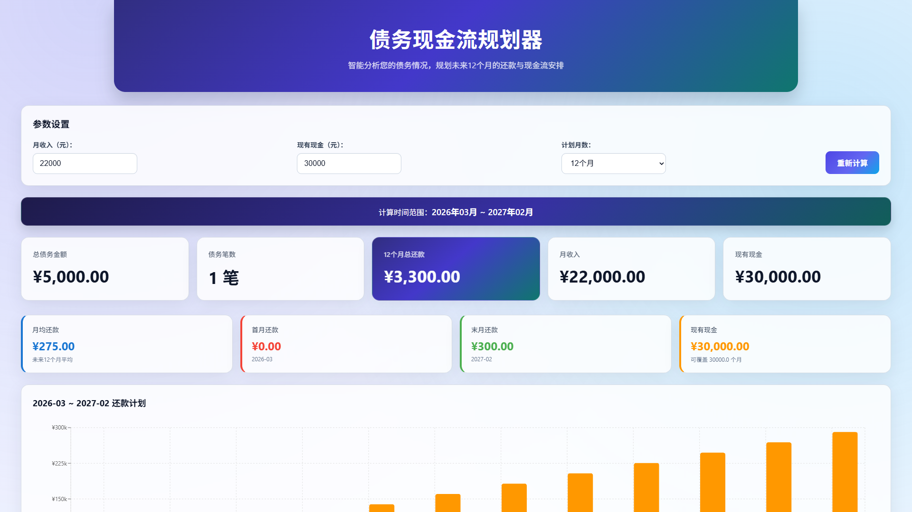
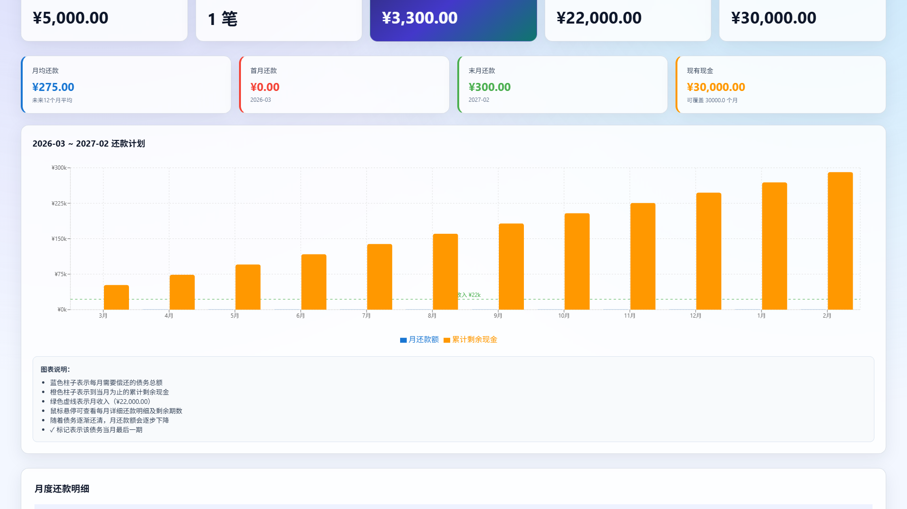
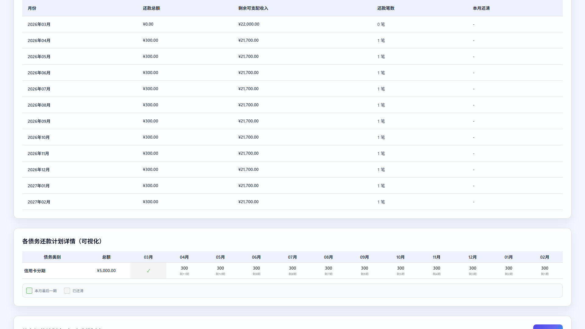

# debt-cashflow-planner

一个用于生成个人债务还款计划与现金流预测的纯前端可视化工具，支持本地持久化与 PWA 安装。

## 项目简介

`debt-cashflow-planner` 可以根据债务列表、月收入和当前现金余额，生成未来 12、18、24 个月的还款计划，并通过图表、表格和可复制文本的方式展示结果，方便用于日常规划、复盘和分享。

当前版本已优先改造成：

- 纯前端运行，无需后台服务
- 数据保存在当前设备浏览器 `localStorage`
- 支持 JSON 导入与导出
- 支持基础 PWA 安装与离线访问
- 适合直接部署到 `GitHub Pages`

## 功能特性

- 支持基于债务明细从当前月份起生成未来多个月份的还款计划
- 支持按月收入和当前现金动态测算现金流变化
- 支持展示每月还款总额、本金、利息、可支配收入和累计现金
- 支持查看每笔债务在各个月份的本金/利息拆分和剩余期数变化
- 支持本地保存债务数据，并在下次打开时自动恢复
- 支持导入、导出 JSON，便于备份与迁移
- 支持导出可复制的 Markdown 文本版本，便于粘贴到 Notion、Excel 或文档
- 支持以 PWA 方式安装到桌面或移动设备主屏幕

## 页面预览

### 首屏总览



### 还款计划图表



### 明细与计划表



## 技术栈

- 前端：React、TypeScript、Recharts
- 数据存储：浏览器 `localStorage`
- PWA：`manifest.json` + `service worker`
- 部署：静态站点部署，推荐 `GitHub Pages`

## 目录结构

```text
.
├─ public/                 # 静态资源与 PWA 配置
├─ src/                    # React 前端源码
├─ docs/
│  └─ screenshots/         # README 页面截图
├─ Dockerfile
├─ docker-compose.yml
├─ package.json
└─ README.md
```

## 本地启动

### 1. 安装依赖

```bash
npm install
```

### 2. 启动前端开发环境

```bash
npm start
```

默认地址：`http://localhost:3000`

## 构建生产版本

```bash
npm run build
```

构建产物会输出到 `build`，可直接作为静态站点部署。

## 数据存储说明

项目当前默认使用一份内置示例债务数据，并在用户首次保存后将数据写入浏览器 `localStorage`。

单条债务字段包括：

- `category`：债务类别
- `totalAmount`：总借款金额
- `remainingPeriods`：分期数
- `annualInterestRate`：年化利息，百分比数值，例如 `7.2` 表示年化 7.2%
- `nextRepaymentMonth`：第一次还款月份，格式为 `YYYY-MM`

补充说明：

- 还款计划使用等额本息公式计算；年化利息为 `0` 时按本金平均分摊
- 旧版包含 `monthlyPayment` 或缺少 `annualInterestRate` 的 JSON 不再兼容，请按新字段重新录入或导入
- 若清除浏览器站点数据，已保存的本地债务信息也会被清除
- 可通过“导出 JSON”手动备份本地数据
- 可通过“导入 JSON”在同一设备或不同设备之间迁移数据

## PWA 说明

项目已补齐基础 PWA 能力：

- `manifest.json`：提供应用名称、主题色和图标
- `service worker`：缓存应用壳与静态资源
- 支持安装到桌面或移动端主屏幕
- 资源缓存后可离线打开已访问过的页面

说明：

- 浏览器通常只会在生产环境下启用 `service worker`
- 首次访问后需要等待资源缓存完成，离线体验才会稳定
- 若发布了新版本，浏览器可能会在下次刷新后更新缓存

## GitHub Pages 部署

当前根目录 `package.json` 已设置 `"homepage": "."`，构建产物会优先使用相对路径，便于部署到仓库子路径。

### 手动发布

一种简单做法：

1. 在仓库中提交代码
2. 在仓库根目录执行 `npm run build`
3. 将 `build` 目录内容发布到 GitHub Pages

### GitHub Actions 自动发布

仓库已补充工作流文件：

- `.github/workflows/deploy-pages.yml`

默认行为：

- 推送到 `main` 分支时自动构建并发布
- 也支持在 GitHub Actions 页面手动触发
- 工作流会直接在仓库根目录安装依赖并构建 `build`

首次启用时，请在 GitHub 仓库设置中确认：

1. 打开 `Settings`
2. 进入 `Pages`
3. 在 `Build and deployment` 中将来源设置为 `GitHub Actions`

之后只要向 `main` 推送代码，工作流就会自动执行并更新 Pages 站点。

## 推送到 GitHub

推荐仓库名：`debt-cashflow-planner`

如果你准备新建 GitHub 仓库并推送本地代码，可参考以下命令：

```bash
git init
git add .
git commit -m "初始化 debt-cashflow-planner 项目"
git branch -M main
git remote add origin <你的仓库地址>
git push -u origin main
```

## 后续可扩展方向

- 增加云端同步与账号登录
- 支持提前还款、一次性冲抵等策略模拟
- 支持多套还款策略对比
- 接入数据库持久化和用户系统
